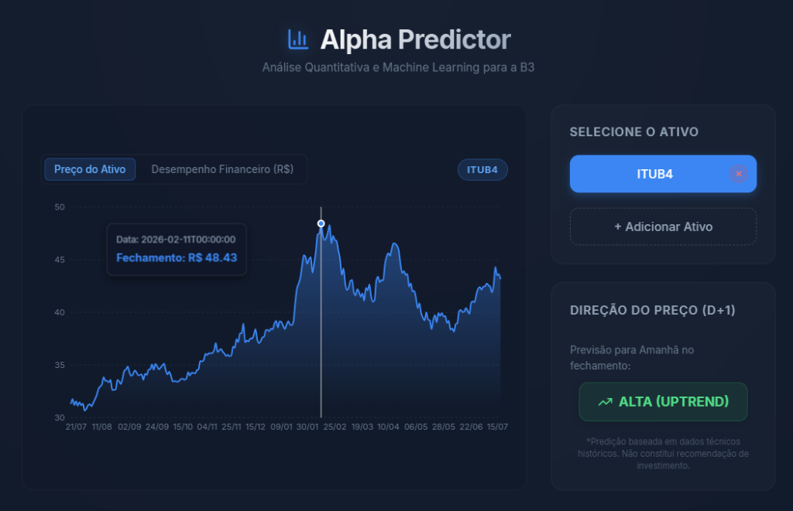
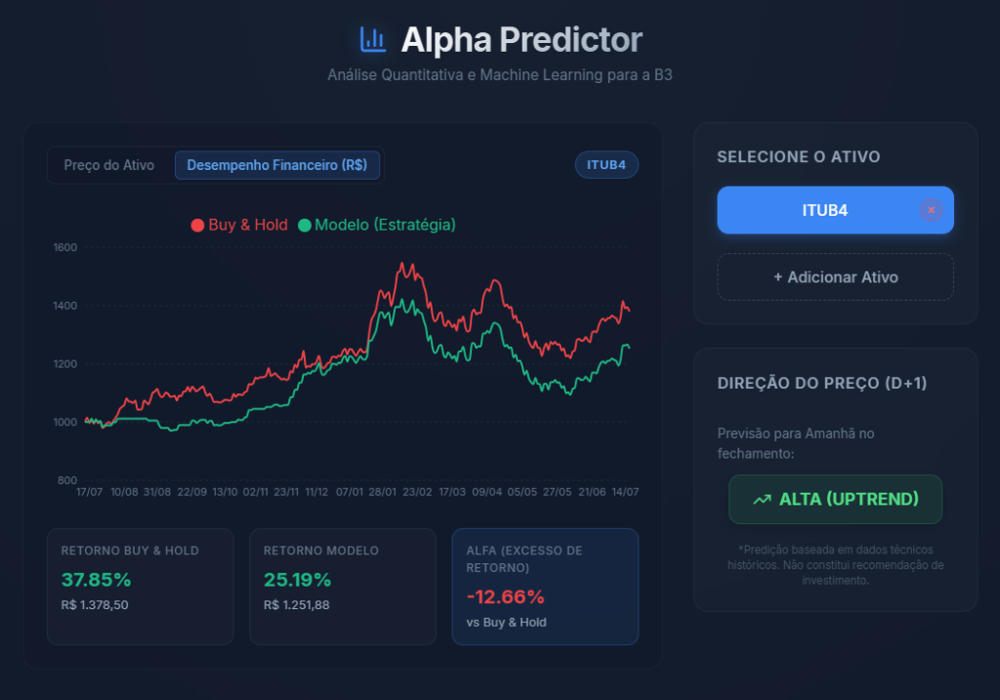
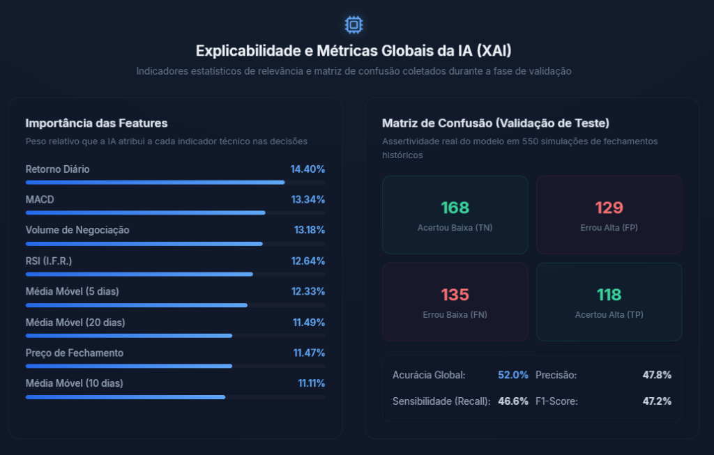

# Alpha Predictor: IA para Previsão de Ações (B3) 📈

[](https://fastapi.tiangolo.com)
[](https://react.dev)
[](https://www.docker.com)
[](LICENSE)

Uma ferramenta interativa que utiliza **Inteligência Artificial** (Machine Learning) para prever a direção do movimento de fechamento (Alta ou Baixa) de ações da Bolsa brasileira (B3) para o dia seguinte (D+1).

Este é um projeto de portfólio completo que demonstra a integração de um pipeline de Data Science, uma API de alto desempenho em Python e um dashboard moderno em React, tudo empacotado em containers prontos para produção.

---

## 🖥️ Demonstração Visual

Aqui está uma prévia do sistema rodando com o painel gráfico interativo de ações e as predições geradas pela inteligência artificial:

### 1. Painel Principal (Gráfico de Preço)


### 2. Backtesting Quantitativo (Retorno Acumulado vs Buy & Hold)


### 3. Painel de Explicabilidade & Métricas de IA (XAI)


### 4. Busca Dinâmica e Persistente de Ativos da B3


---

## ✨ Funcionalidades Principais

* **Predição Direcional de Ativos (D+1)**: Classificação estatística informando a tendência para o próximo fechamento (ALTA ou BAIXA) baseada em indicadores técnicos.
* **Backtesting Quantitativo em Tempo Real**: Comparação direta do rendimento acumulado da estratégia da IA contra a compra passiva (*Buy & Hold*), calculando a geração de *Alfa* sobre uma simulação financeira de R$ 1.000,00.
* **Explicabilidade de Modelo (XAI)**: Transparência total mostrando o peso de cada indicador técnico na decisão da IA (Feature Importance) e a Matriz de Confusão de teste do modelo.
* **Seleção Dinâmica de Tickers**: Busca direta no Yahoo Finance para qualquer ticker brasileiro da B3 via modal com persistência de lista no navegador (*localStorage*).
* **Gráficos Interativos**: Gráficos dinâmicos construídos com React e Recharts que se adaptam dinamicamente ao ativo selecionado.

---

## 🚀 Como Executar o Projeto em 1 Minuto (Docker)

Toda a infraestrutura do projeto (React Frontend e FastAPI Backend) foi containerizada. Você não precisa instalar Python, Node ou configurar variáveis locais.

### Pré-requisitos
* [Docker Desktop](https://www.docker.com/products/docker-desktop/) instalado e aberto.

### Rodar a Aplicação
Abra o terminal na pasta raiz do projeto e execute:

```bash
docker compose up --build
```

Após a inicialização rápida, acesse no seu navegador:
* 🌐 **Interface Web (React):** [http://localhost:3000](http://localhost:3000)
* ⚙️ **Documentação da API (FastAPI):** [http://localhost:8000/docs](http://localhost:8000/docs)

*(Para desligar os servidores, use o comando: `docker compose down`)*

---

## 📘 Detalhes Técnicos e Arquitetura

Se você é um desenvolvedor, líder técnico ou recrutador técnico e quer entender as decisões de engenharia por trás deste projeto (como cache em memória RAM, tratamento de nulos em séries temporais e performance dos modelos), acesse o documento completo:

👉 **[Ler Documento de Detalhes Técnicos (TECHNICAL.md)](TECHNICAL.md)**

---

## 📁 Estrutura Simplificada

```
└── 📁Alpha-Predictor/
    ├── 📁backend/         # API FastAPI & Configurações Docker
    ├── 📁frontend/        # Dashboard React (Vite, Recharts e CSS Moderno)
    ├── 📁notebooks/       # Jupyter Notebooks com análises de Data Science
    ├── 📁src/             # Código-fonte da pipeline de Machine Learning
    ├── docker-compose.yml # Orquestrador de infraestrutura
    └── TECHNICAL.md       # Explicações técnicas detalhadas das decisões do projeto
```